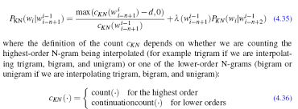

```{r setup, include=FALSE}
knitr::opts_chunk$set(echo = TRUE)

library(ggplot2)
```

## Overview


 


- This shiny app was built for the course Capstone as part of the Coursera Data Science Specialization.

- The shiny app developed for this assignment is available at: https://thierryfauret.shinyapps.io/temp/


 

## Application presentation {.smaller}


The objective of the application is to predict the next word of a sentence.


 


The input data are :

- a sentence (in english)

The output data is :

- the most probable word in accordance to the chosen model.


After having launched the app, when you modify the sentence, the research of the new next word is performed very quickly.


## Algorithm presentation {.smaller}

The 1-grams, 2-grams, 3-grams and 4-grams have been calculated after having cleaned a data base of twitter, blogs and news (english texts).

Two models have been tested :

- kneser-ney smoothing




- basic algorithm : most probable 4-grams based on the 3 last words of the sentence. If no solution, most probable 3-grams based on the 2 last words of the sentence. If no solution, the most probable  2-grams based on the last word of the sentence.


In the application, the second one is implemented because of its efficiency and its processing speed validated on a test data base.
The library ngram is used because it is very efficient as the functions are developped directly in C++.


## Resources {.smaller}


The sources files are available  :

- The source codes of ui.R and server.R are available on the GitHub repo: https://github.com/FAURET/NextWord


The documentation used for the modeling is :

- Text Mining Infrastructure in R - Ingo Feinerer - Kurt Hornik - David Meyer (Journal Of Statistical Software MArch 2008, Volume 25, Issue 5)

- Speech and language Processing. Daniel Jurafsky & JAmes H. Martin. Chapter 4. N-grams


